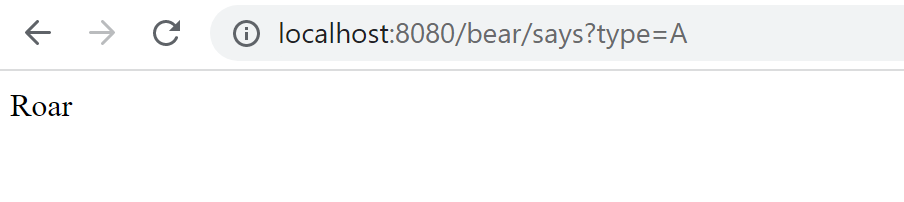
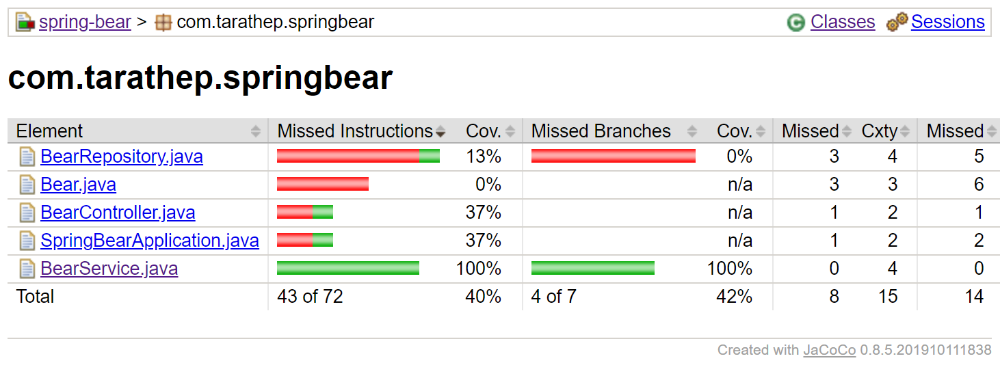
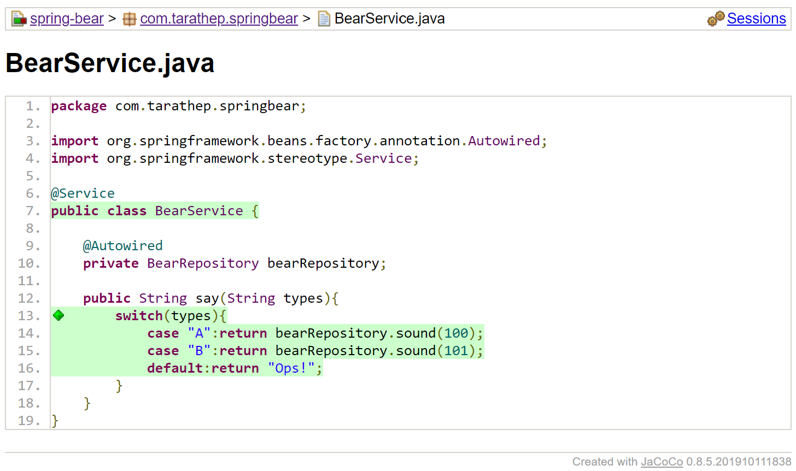

# Spring Bear

This Example Spring Boot Framework for deploy to Azure Spring Cloud + Unitest with Mockito

## Why Spring?

Spring makes programming Java quicker, easier, and safer for everybody. Spring’s focus on speed, simplicity, and productivity has made it the world's most popular Java framework.


Use Spring Boot framework ``Version 7.2.3 Snapshot`` on ``Java version 8`` and ``dependencies`` following.

- spring-boot-starter-actuator
- spring-boot-starter-web
- spring-cloud-starter-config
- spring-cloud-starter-netflix-eureka-client
- spring-boot-starter-test
- jacoco-maven-plugin v 0.8.5

    ```xml
    <plugin>
        <groupId>org.jacoco</groupId>
        <artifactId>jacoco-maven-plugin</artifactId>
        <version>0.8.5</version>
        <executions>
            <execution>
            <goals>
                <goal>prepare-agent</goal>
            </goals>
            </execution>
            <execution>
            <id>report</id>
            <phase>test</phase>
            <goals>
                <goal>report</goal>
            </goals>
            </execution>
        </executions>
    </plugin>
    ```

## Run

for run on developing and debuging

```bash
mvn spring-boot:run
```

Example application

http://localhost:8080/bear/says?type=A

http://localhost:8080/bear/says?type=B



## Unit Testing

using Mockito and Jacoco report focusing at service.

```bash
mvn test
```

export report at ```./target/site/jacoco```



Code coverage



## Build

build artifact to .JAR file

```bash
mvn package
```

## Deploy to Azure Spring Cloud App


 ```Azure Spring Apps``` makes it easy to deploy Spring Boot applications to Azure without any code changes. The service manages the infrastructure of Spring applications so developers can focus on their code. Azure Spring Apps provides lifecycle management using comprehensive monitoring and diagnostics, configuration management, service discovery, CI/CD integration, blue-green deployments, and more.

### Provision an instance of Azure Spring Apps

The following procedure creates an instance of Azure Spring Apps using the Azure portal.

1. In a new tab, open the Azure portal.
2. From the top search box, search for Azure Spring Apps.
3. Select Azure Spring Apps from the results

    

4. On the Azure Spring Apps page, select Create.

    


### Build and deploy the app

build jar with skip unitest testing

```cmd
mvn clean package -DskipTests
```

Create instant app on azure spirng app

```cmd
az spring app create -n spring-bear -s spring-cdc04-az-asse-dev-001 -g rg-cdc04-az-asse-dev-001 --assign-endpoint true
```

Deploy to spring cloud

```cmd
az spring app deploy -n spring-bear -g rg-cdc04-az-asse-dev-001 -s spring-cdc04-az-asse-dev-001 --artifact-path target\spring-bear-0.0.1-SNAPSHOT.jar
```

## Streaming logs in real time

Use the following command to get real-time logs from the App.

```cmd
az spring app logs -n spring-bear -s spring-cdc04-az-asse-dev-001 -g rg-cdc04-az-asse-dev-001 --lines 100 -f
```

or can use Log Analytics Workspaces , visit the Logs

more : https://docs.microsoft.com/en-us/azure/spring-apps/quickstart?tabs=Azure-CLI&pivots=programming-language-java

## Use Azure Spring Apps CI/CD with GitHub Actions

GitHub Actions support an automated software development lifecycle workflow. With GitHub Actions for Azure Spring Apps you can create workflows in your repository to build, test, package, release, and deploy to Azure.

https://docs.microsoft.com/en-us/azure/spring-apps/how-to-github-actions?pivots=programming-language-java#to-production